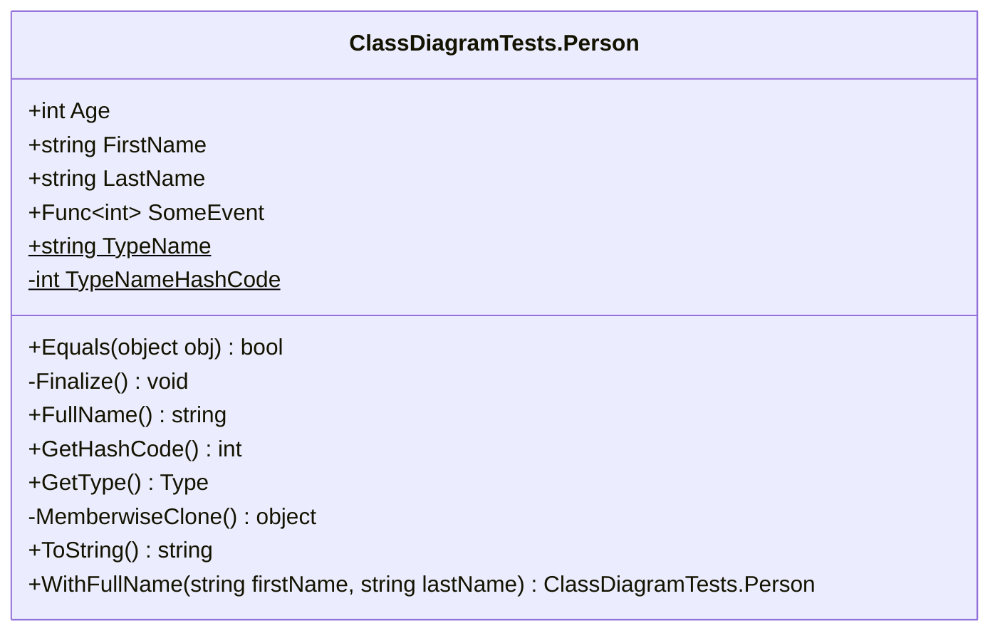

```mermaid
classDiagram
class `ClassDiagramTests.Person`
`ClassDiagramTests.Person` : +int Age
`ClassDiagramTests.Person` : +string FirstName
`ClassDiagramTests.Person` : +string LastName
`ClassDiagramTests.Person` : +Func&ltint> SomeEvent
`ClassDiagramTests.Person` : +string TypeName$
`ClassDiagramTests.Person` : -int TypeNameHashCode$
`ClassDiagramTests.Person` : +Equals(object obj) bool
`ClassDiagramTests.Person` : -Finalize() void
`ClassDiagramTests.Person` : +FullName() string
`ClassDiagramTests.Person` : +GetHashCode() int
`ClassDiagramTests.Person` : +GetType() Type
`ClassDiagramTests.Person` : -MemberwiseClone() object
`ClassDiagramTests.Person` : +ToString() string
`ClassDiagramTests.Person` : +WithFullName(string firstName, string lastName) ClassDiagramTests.Person
```
