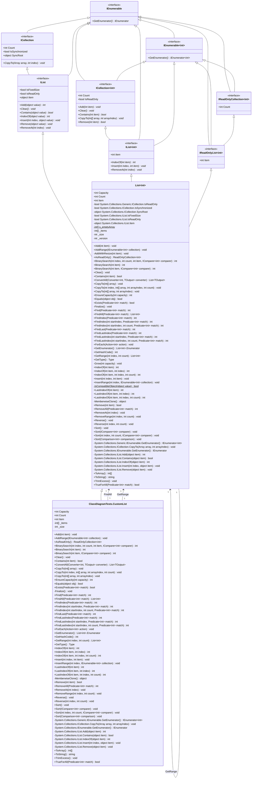

```mermaid
classDiagram
`List&ltint>` <|-- `ClassDiagramTests.CustomList`
`IEnumerable` <|-- `ICollection`
`IEnumerable` <|-- `ICollection&ltint>`
`IEnumerable&ltint>` <|-- `ICollection&ltint>`
`IEnumerable` <|-- `IEnumerable&ltint>`
`ICollection` <|-- `IList`
`IEnumerable` <|-- `IList`
`ICollection&ltint>` <|-- `IList&ltint>`
`IEnumerable` <|-- `IList&ltint>`
`IEnumerable&ltint>` <|-- `IList&ltint>`
`IEnumerable` <|-- `IReadOnlyCollection&ltint>`
`IEnumerable&ltint>` <|-- `IReadOnlyCollection&ltint>`
`IEnumerable` <|-- `IReadOnlyList&ltint>`
`IEnumerable&ltint>` <|-- `IReadOnlyList&ltint>`
`IReadOnlyCollection&ltint>` <|-- `IReadOnlyList&ltint>`
`IList` <|-- `List&ltint>`
`IList&ltint>` <|-- `List&ltint>`
`IReadOnlyList&ltint>` <|-- `List&ltint>`
`List&ltint>` "1"  <--  "1" `ClassDiagramTests.CustomList` : FindAll
`List&ltint>` "1"  <--  "1" `ClassDiagramTests.CustomList` : GetRange
`List&ltint>` "1"  <--  "1" `List&ltint>` : FindAll
`List&ltint>` "1"  <--  "1" `List&ltint>` : GetRange
class `ClassDiagramTests.CustomList`
`ClassDiagramTests.CustomList` : +int Capacity
`ClassDiagramTests.CustomList` : +int Count
`ClassDiagramTests.CustomList` : +int Item
`ClassDiagramTests.CustomList` : -int[] _items
`ClassDiagramTests.CustomList` : -int _size
`ClassDiagramTests.CustomList` : +Add(int item) void
`ClassDiagramTests.CustomList` : +AddRange(IEnumerable&ltint> collection) void
`ClassDiagramTests.CustomList` : +AsReadOnly() ReadOnlyCollection&ltint>
`ClassDiagramTests.CustomList` : +BinarySearch(int index, int count, int item, IComparer&ltint> comparer) int
`ClassDiagramTests.CustomList` : +BinarySearch(int item) int
`ClassDiagramTests.CustomList` : +BinarySearch(int item, IComparer&ltint> comparer) int
`ClassDiagramTests.CustomList` : +Clear() void
`ClassDiagramTests.CustomList` : +Contains(int item) bool
`ClassDiagramTests.CustomList` : +ConvertAll(Converter&ltint, TOutput> converter) List&ltTOutput>
`ClassDiagramTests.CustomList` : +CopyTo(int[] array) void
`ClassDiagramTests.CustomList` : +CopyTo(int index, int[] array, int arrayIndex, int count) void
`ClassDiagramTests.CustomList` : +CopyTo(int[] array, int arrayIndex) void
`ClassDiagramTests.CustomList` : +EnsureCapacity(int capacity) int
`ClassDiagramTests.CustomList` : +Equals(object obj) bool
`ClassDiagramTests.CustomList` : +Exists(Predicate&ltint> match) bool
`ClassDiagramTests.CustomList` : -Finalize() void
`ClassDiagramTests.CustomList` : +Find(Predicate&ltint> match) int
`ClassDiagramTests.CustomList` : +FindAll(Predicate&ltint> match) List&ltint>
`ClassDiagramTests.CustomList` : +FindIndex(Predicate&ltint> match) int
`ClassDiagramTests.CustomList` : +FindIndex(int startIndex, Predicate&ltint> match) int
`ClassDiagramTests.CustomList` : +FindIndex(int startIndex, int count, Predicate&ltint> match) int
`ClassDiagramTests.CustomList` : +FindLast(Predicate&ltint> match) int
`ClassDiagramTests.CustomList` : +FindLastIndex(Predicate&ltint> match) int
`ClassDiagramTests.CustomList` : +FindLastIndex(int startIndex, Predicate&ltint> match) int
`ClassDiagramTests.CustomList` : +FindLastIndex(int startIndex, int count, Predicate&ltint> match) int
`ClassDiagramTests.CustomList` : +ForEach(Action&ltint> action) void
`ClassDiagramTests.CustomList` : +GetEnumerator() List&ltint>.Enumerator
`ClassDiagramTests.CustomList` : +GetHashCode() int
`ClassDiagramTests.CustomList` : +GetRange(int index, int count) List&ltint>
`ClassDiagramTests.CustomList` : +GetType() Type
`ClassDiagramTests.CustomList` : +IndexOf(int item) int
`ClassDiagramTests.CustomList` : +IndexOf(int item, int index) int
`ClassDiagramTests.CustomList` : +IndexOf(int item, int index, int count) int
`ClassDiagramTests.CustomList` : +Insert(int index, int item) void
`ClassDiagramTests.CustomList` : +InsertRange(int index, IEnumerable&ltint> collection) void
`ClassDiagramTests.CustomList` : +LastIndexOf(int item) int
`ClassDiagramTests.CustomList` : +LastIndexOf(int item, int index) int
`ClassDiagramTests.CustomList` : +LastIndexOf(int item, int index, int count) int
`ClassDiagramTests.CustomList` : -MemberwiseClone() object
`ClassDiagramTests.CustomList` : +Remove(int item) bool
`ClassDiagramTests.CustomList` : +RemoveAll(Predicate&ltint> match) int
`ClassDiagramTests.CustomList` : +RemoveAt(int index) void
`ClassDiagramTests.CustomList` : +RemoveRange(int index, int count) void
`ClassDiagramTests.CustomList` : +Reverse() void
`ClassDiagramTests.CustomList` : +Reverse(int index, int count) void
`ClassDiagramTests.CustomList` : +Sort() void
`ClassDiagramTests.CustomList` : +Sort(IComparer&ltint> comparer) void
`ClassDiagramTests.CustomList` : +Sort(int index, int count, IComparer&ltint> comparer) void
`ClassDiagramTests.CustomList` : +Sort(Comparison&ltint> comparison) void
`ClassDiagramTests.CustomList` : -System.Collections.Generic.IEnumerable<T>.GetEnumerator() IEnumerator&ltint>
`ClassDiagramTests.CustomList` : -System.Collections.ICollection.CopyTo(Array array, int arrayIndex) void
`ClassDiagramTests.CustomList` : -System.Collections.IEnumerable.GetEnumerator() IEnumerator
`ClassDiagramTests.CustomList` : -System.Collections.IList.Add(object item) int
`ClassDiagramTests.CustomList` : -System.Collections.IList.Contains(object item) bool
`ClassDiagramTests.CustomList` : -System.Collections.IList.IndexOf(object item) int
`ClassDiagramTests.CustomList` : -System.Collections.IList.Insert(int index, object item) void
`ClassDiagramTests.CustomList` : -System.Collections.IList.Remove(object item) void
`ClassDiagramTests.CustomList` : +ToArray() int[]
`ClassDiagramTests.CustomList` : +ToString() string
`ClassDiagramTests.CustomList` : +TrimExcess() void
`ClassDiagramTests.CustomList` : +TrueForAll(Predicate&ltint> match) bool
class `ICollection`
<<interface>> `ICollection`
`ICollection` : +int Count
`ICollection` : +bool IsSynchronized
`ICollection` : +object SyncRoot
`ICollection` : +CopyTo(Array array, int index) void*
class `ICollection&ltint>`
<<interface>> `ICollection&ltint>`
`ICollection&ltint>` : +int Count
`ICollection&ltint>` : +bool IsReadOnly
`ICollection&ltint>` : +Add(int item) void*
`ICollection&ltint>` : +Clear() void*
`ICollection&ltint>` : +Contains(int item) bool*
`ICollection&ltint>` : +CopyTo(int[] array, int arrayIndex) void*
`ICollection&ltint>` : +Remove(int item) bool*
class `IEnumerable`
<<interface>> `IEnumerable`
`IEnumerable` : +GetEnumerator() IEnumerator*
class `IEnumerable&ltint>`
<<interface>> `IEnumerable&ltint>`
`IEnumerable&ltint>` : +GetEnumerator() IEnumerator&ltint>*
class `IList`
<<interface>> `IList`
`IList` : +bool IsFixedSize
`IList` : +bool IsReadOnly
`IList` : +object Item*
`IList` : +Add(object value) int*
`IList` : +Clear() void*
`IList` : +Contains(object value) bool*
`IList` : +IndexOf(object value) int*
`IList` : +Insert(int index, object value) void*
`IList` : +Remove(object value) void*
`IList` : +RemoveAt(int index) void*
class `IList&ltint>`
<<interface>> `IList&ltint>`
`IList&ltint>` : +int Item*
`IList&ltint>` : +IndexOf(int item) int*
`IList&ltint>` : +Insert(int index, int item) void*
`IList&ltint>` : +RemoveAt(int index) void*
class `IReadOnlyCollection&ltint>`
<<interface>> `IReadOnlyCollection&ltint>`
`IReadOnlyCollection&ltint>` : +int Count
class `IReadOnlyList&ltint>`
<<interface>> `IReadOnlyList&ltint>`
`IReadOnlyList&ltint>` : +int Item
class `List&ltint>`
`List&ltint>` : +int Capacity
`List&ltint>` : +int Count
`List&ltint>` : +int Item
`List&ltint>` : -bool System.Collections.Generic.ICollection<T>.IsReadOnly
`List&ltint>` : -bool System.Collections.ICollection.IsSynchronized
`List&ltint>` : -object System.Collections.ICollection.SyncRoot
`List&ltint>` : -bool System.Collections.IList.IsFixedSize
`List&ltint>` : -bool System.Collections.IList.IsReadOnly
`List&ltint>` : -object System.Collections.IList.Item
`List&ltint>` : -int[] s_emptyArray$
`List&ltint>` : -int[] _items
`List&ltint>` : -int _size
`List&ltint>` : -int _version
`List&ltint>` : +Add(int item) void
`List&ltint>` : +AddRange(IEnumerable&ltint> collection) void
`List&ltint>` : -AddWithResize(int item) void
`List&ltint>` : +AsReadOnly() ReadOnlyCollection&ltint>
`List&ltint>` : +BinarySearch(int index, int count, int item, IComparer&ltint> comparer) int
`List&ltint>` : +BinarySearch(int item) int
`List&ltint>` : +BinarySearch(int item, IComparer&ltint> comparer) int
`List&ltint>` : +Clear() void
`List&ltint>` : +Contains(int item) bool
`List&ltint>` : +ConvertAll(Converter&ltint, TOutput> converter) List&ltTOutput>
`List&ltint>` : +CopyTo(int[] array) void
`List&ltint>` : +CopyTo(int index, int[] array, int arrayIndex, int count) void
`List&ltint>` : +CopyTo(int[] array, int arrayIndex) void
`List&ltint>` : +EnsureCapacity(int capacity) int
`List&ltint>` : +Equals(object obj) bool
`List&ltint>` : +Exists(Predicate&ltint> match) bool
`List&ltint>` : -Finalize() void
`List&ltint>` : +Find(Predicate&ltint> match) int
`List&ltint>` : +FindAll(Predicate&ltint> match) List&ltint>
`List&ltint>` : +FindIndex(Predicate&ltint> match) int
`List&ltint>` : +FindIndex(int startIndex, Predicate&ltint> match) int
`List&ltint>` : +FindIndex(int startIndex, int count, Predicate&ltint> match) int
`List&ltint>` : +FindLast(Predicate&ltint> match) int
`List&ltint>` : +FindLastIndex(Predicate&ltint> match) int
`List&ltint>` : +FindLastIndex(int startIndex, Predicate&ltint> match) int
`List&ltint>` : +FindLastIndex(int startIndex, int count, Predicate&ltint> match) int
`List&ltint>` : +ForEach(Action&ltint> action) void
`List&ltint>` : +GetEnumerator() List&ltint>.Enumerator
`List&ltint>` : +GetHashCode() int
`List&ltint>` : +GetRange(int index, int count) List&ltint>
`List&ltint>` : +GetType() Type
`List&ltint>` : -Grow(int capacity) void
`List&ltint>` : +IndexOf(int item) int
`List&ltint>` : +IndexOf(int item, int index) int
`List&ltint>` : +IndexOf(int item, int index, int count) int
`List&ltint>` : +Insert(int index, int item) void
`List&ltint>` : +InsertRange(int index, IEnumerable&ltint> collection) void
`List&ltint>` : -IsCompatibleObject(object value) bool$
`List&ltint>` : +LastIndexOf(int item) int
`List&ltint>` : +LastIndexOf(int item, int index) int
`List&ltint>` : +LastIndexOf(int item, int index, int count) int
`List&ltint>` : -MemberwiseClone() object
`List&ltint>` : +Remove(int item) bool
`List&ltint>` : +RemoveAll(Predicate&ltint> match) int
`List&ltint>` : +RemoveAt(int index) void
`List&ltint>` : +RemoveRange(int index, int count) void
`List&ltint>` : +Reverse() void
`List&ltint>` : +Reverse(int index, int count) void
`List&ltint>` : +Sort() void
`List&ltint>` : +Sort(IComparer&ltint> comparer) void
`List&ltint>` : +Sort(int index, int count, IComparer&ltint> comparer) void
`List&ltint>` : +Sort(Comparison&ltint> comparison) void
`List&ltint>` : -System.Collections.Generic.IEnumerable<T>.GetEnumerator() IEnumerator&ltint>
`List&ltint>` : -System.Collections.ICollection.CopyTo(Array array, int arrayIndex) void
`List&ltint>` : -System.Collections.IEnumerable.GetEnumerator() IEnumerator
`List&ltint>` : -System.Collections.IList.Add(object item) int
`List&ltint>` : -System.Collections.IList.Contains(object item) bool
`List&ltint>` : -System.Collections.IList.IndexOf(object item) int
`List&ltint>` : -System.Collections.IList.Insert(int index, object item) void
`List&ltint>` : -System.Collections.IList.Remove(object item) void
`List&ltint>` : +ToArray() int[]
`List&ltint>` : +ToString() string
`List&ltint>` : +TrimExcess() void
`List&ltint>` : +TrueForAll(Predicate&ltint> match) bool
```
