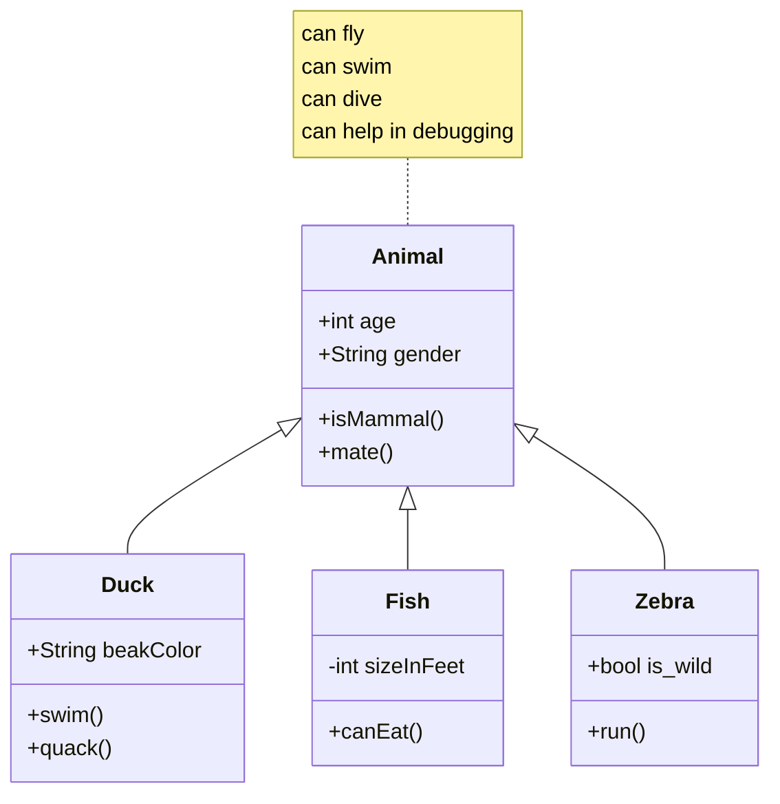

```mermaid
classDiagram
`Animal` <|-- `Duck`
`Animal` <|-- `Fish`
`Animal` <|-- `Zebra`
note for `Animal` "can fly
can swim
can dive
can help in debugging"
class `Animal`
`Animal` : +int age
`Animal` : +String gender
`Animal` : +isMammal() 
`Animal` : +mate() 
class `Duck`
`Duck` : +String beakColor
`Duck` : +swim() 
`Duck` : +quack() 
class `Fish`
`Fish` : -int sizeInFeet
`Fish` : +canEat() 
class `Zebra`
`Zebra` : +bool is_wild
`Zebra` : +run() 
```
