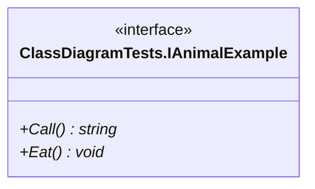

```mermaid
classDiagram
class `ClassDiagramTests.IAnimalExample`
<<interface>> `ClassDiagramTests.IAnimalExample`
`ClassDiagramTests.IAnimalExample` : +Call() string*
`ClassDiagramTests.IAnimalExample` : +Eat() void*
```
