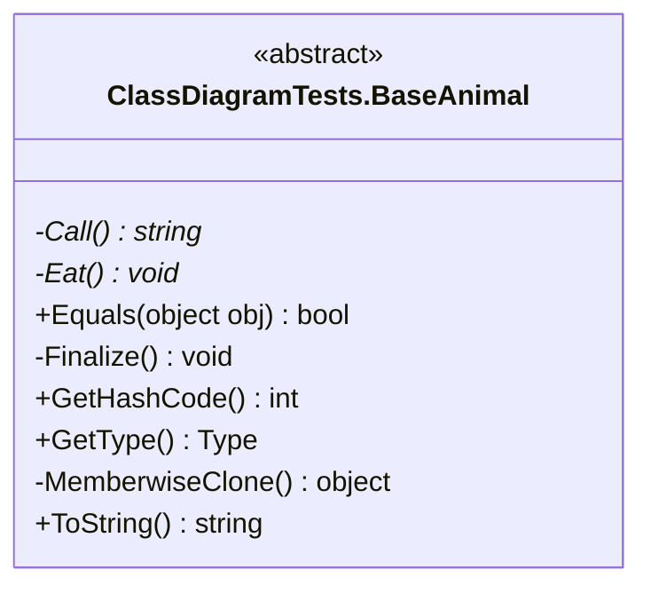

```mermaid
classDiagram
class `ClassDiagramTests.BaseAnimal`
<<abstract>> `ClassDiagramTests.BaseAnimal`
`ClassDiagramTests.BaseAnimal` : -Call() string*
`ClassDiagramTests.BaseAnimal` : -Eat() void*
`ClassDiagramTests.BaseAnimal` : +Equals(object obj) bool
`ClassDiagramTests.BaseAnimal` : -Finalize() void
`ClassDiagramTests.BaseAnimal` : +GetHashCode() int
`ClassDiagramTests.BaseAnimal` : +GetType() Type
`ClassDiagramTests.BaseAnimal` : -MemberwiseClone() object
`ClassDiagramTests.BaseAnimal` : +ToString() string
```
