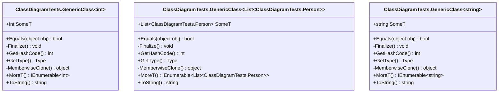

```mermaid
classDiagram
class `ClassDiagramTests.GenericClass&ltint>`
`ClassDiagramTests.GenericClass&ltint>` : +int SomeT
`ClassDiagramTests.GenericClass&ltint>` : +Equals(object obj) bool
`ClassDiagramTests.GenericClass&ltint>` : -Finalize() void
`ClassDiagramTests.GenericClass&ltint>` : +GetHashCode() int
`ClassDiagramTests.GenericClass&ltint>` : +GetType() Type
`ClassDiagramTests.GenericClass&ltint>` : -MemberwiseClone() object
`ClassDiagramTests.GenericClass&ltint>` : +MoreT() IEnumerable&ltint>
`ClassDiagramTests.GenericClass&ltint>` : +ToString() string
class `ClassDiagramTests.GenericClass&ltList&ltClassDiagramTests.Person>>`
`ClassDiagramTests.GenericClass&ltList&ltClassDiagramTests.Person>>` : +List&ltClassDiagramTests.Person> SomeT
`ClassDiagramTests.GenericClass&ltList&ltClassDiagramTests.Person>>` : +Equals(object obj) bool
`ClassDiagramTests.GenericClass&ltList&ltClassDiagramTests.Person>>` : -Finalize() void
`ClassDiagramTests.GenericClass&ltList&ltClassDiagramTests.Person>>` : +GetHashCode() int
`ClassDiagramTests.GenericClass&ltList&ltClassDiagramTests.Person>>` : +GetType() Type
`ClassDiagramTests.GenericClass&ltList&ltClassDiagramTests.Person>>` : -MemberwiseClone() object
`ClassDiagramTests.GenericClass&ltList&ltClassDiagramTests.Person>>` : +MoreT() IEnumerable&ltList&ltClassDiagramTests.Person>>
`ClassDiagramTests.GenericClass&ltList&ltClassDiagramTests.Person>>` : +ToString() string
class `ClassDiagramTests.GenericClass&ltstring>`
`ClassDiagramTests.GenericClass&ltstring>` : +string SomeT
`ClassDiagramTests.GenericClass&ltstring>` : +Equals(object obj) bool
`ClassDiagramTests.GenericClass&ltstring>` : -Finalize() void
`ClassDiagramTests.GenericClass&ltstring>` : +GetHashCode() int
`ClassDiagramTests.GenericClass&ltstring>` : +GetType() Type
`ClassDiagramTests.GenericClass&ltstring>` : -MemberwiseClone() object
`ClassDiagramTests.GenericClass&ltstring>` : +MoreT() IEnumerable&ltstring>
`ClassDiagramTests.GenericClass&ltstring>` : +ToString() string
```
