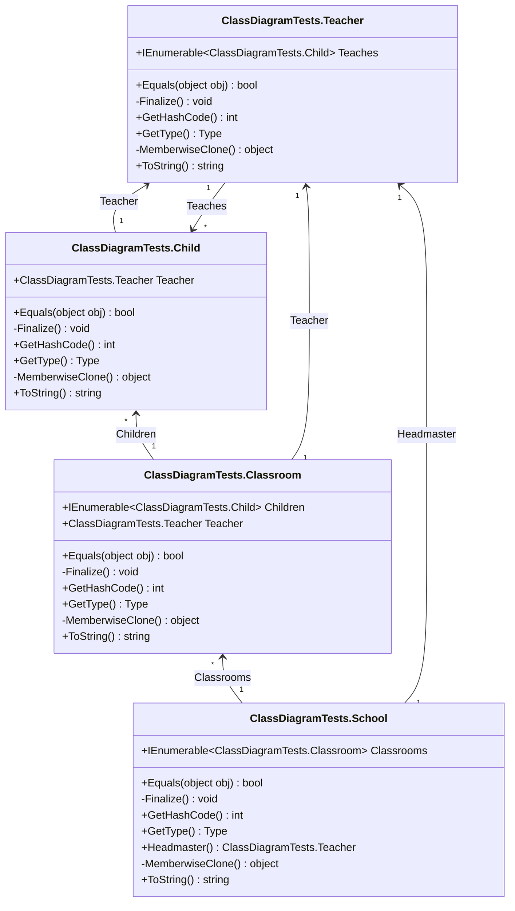

```mermaid
classDiagram
`ClassDiagramTests.Teacher` "1"  <--  "1" `ClassDiagramTests.Child` : Teacher
`ClassDiagramTests.Child` "*"  <--  "1" `ClassDiagramTests.Classroom` : Children
`ClassDiagramTests.Teacher` "1"  <--  "1" `ClassDiagramTests.Classroom` : Teacher
`ClassDiagramTests.Classroom` "*"  <--  "1" `ClassDiagramTests.School` : Classrooms
`ClassDiagramTests.Teacher` "1"  <--  "1" `ClassDiagramTests.School` : Headmaster
`ClassDiagramTests.Child` "*"  <--  "1" `ClassDiagramTests.Teacher` : Teaches
class `ClassDiagramTests.Child`
`ClassDiagramTests.Child` : +ClassDiagramTests.Teacher Teacher
`ClassDiagramTests.Child` : +Equals(object obj) bool
`ClassDiagramTests.Child` : -Finalize() void
`ClassDiagramTests.Child` : +GetHashCode() int
`ClassDiagramTests.Child` : +GetType() Type
`ClassDiagramTests.Child` : -MemberwiseClone() object
`ClassDiagramTests.Child` : +ToString() string
class `ClassDiagramTests.Classroom`
`ClassDiagramTests.Classroom` : +IEnumerable&ltClassDiagramTests.Child> Children
`ClassDiagramTests.Classroom` : +ClassDiagramTests.Teacher Teacher
`ClassDiagramTests.Classroom` : +Equals(object obj) bool
`ClassDiagramTests.Classroom` : -Finalize() void
`ClassDiagramTests.Classroom` : +GetHashCode() int
`ClassDiagramTests.Classroom` : +GetType() Type
`ClassDiagramTests.Classroom` : -MemberwiseClone() object
`ClassDiagramTests.Classroom` : +ToString() string
class `ClassDiagramTests.School`
`ClassDiagramTests.School` : +IEnumerable&ltClassDiagramTests.Classroom> Classrooms
`ClassDiagramTests.School` : +Equals(object obj) bool
`ClassDiagramTests.School` : -Finalize() void
`ClassDiagramTests.School` : +GetHashCode() int
`ClassDiagramTests.School` : +GetType() Type
`ClassDiagramTests.School` : +Headmaster() ClassDiagramTests.Teacher
`ClassDiagramTests.School` : -MemberwiseClone() object
`ClassDiagramTests.School` : +ToString() string
class `ClassDiagramTests.Teacher`
`ClassDiagramTests.Teacher` : +IEnumerable&ltClassDiagramTests.Child> Teaches
`ClassDiagramTests.Teacher` : +Equals(object obj) bool
`ClassDiagramTests.Teacher` : -Finalize() void
`ClassDiagramTests.Teacher` : +GetHashCode() int
`ClassDiagramTests.Teacher` : +GetType() Type
`ClassDiagramTests.Teacher` : -MemberwiseClone() object
`ClassDiagramTests.Teacher` : +ToString() string
```
